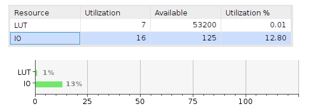
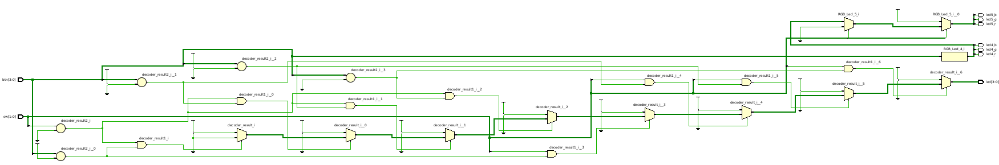

# FPGA Design Questions

## 1. How many look-up-tables (LUTs) does the design use?
(See synthesis/utilization report)

Awnser: LAB2 uses 7 LUTs

## 2. How many registers are used?
In this context, register means the same as flip-flop, that is, a single-bit memory element.  
In microprocessors, registers mean an 8/16/32/64-bit register, depending on the word length of the computer architecture in question.

Awnser: The design is purely combinational and does not contain any clocked processes or sequential logic. All outputs are directly driven by combinational expressions using the inputs (btn and sw) and internal signals (decoder_result, RGB_Led_4, RGB_Led_5). Since no flip-flops are inferred by the synthesis tool, there are no single-bit memory elements (registers) used in this design.

## 3. How many ports have you defined in the entity – does it match with the reported I/O count?

Awnser: I commented 16 I/O ports in .xdc file and summary also shows 16/125 utilized IO ports

## 4. Compare the elaborated design to the synthesized design at the schematics level – what is the difference?

Awnser: Elaborated design gives picture on how gates are arranged in order and gives designer more insights on logic structure. In contrast, the synthesized design mapped gates are obfuscated in LUT tables making it clean looking and easier to read, but harder to indentify exact gates, which will be then harder to debug.

## 5. Does the design fulfil all the timing requirements? What were those?

## Pictures
### Utilization Summary

--------------------
### Elaborated Design

-----

### Synthesized Design

